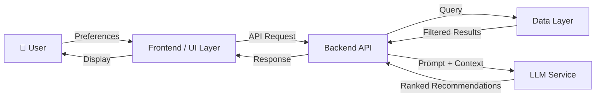
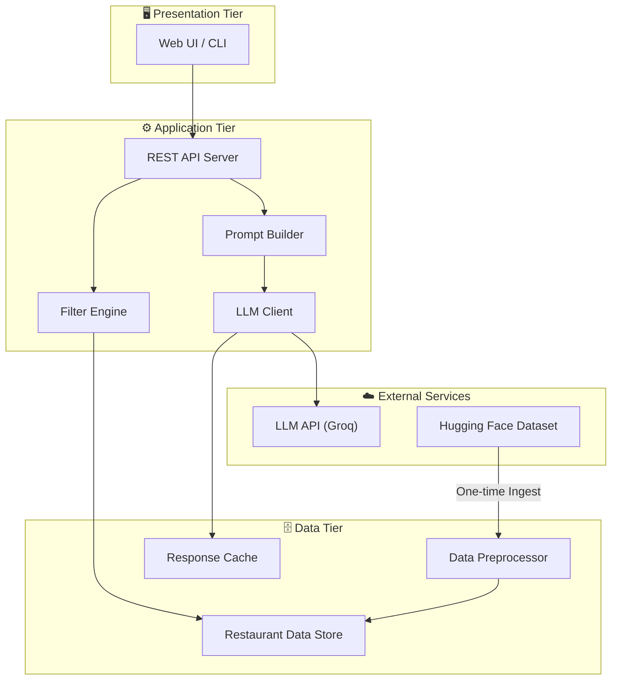
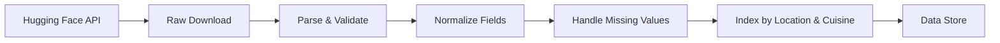
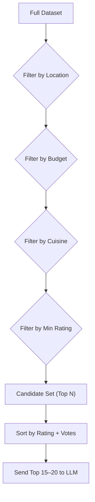
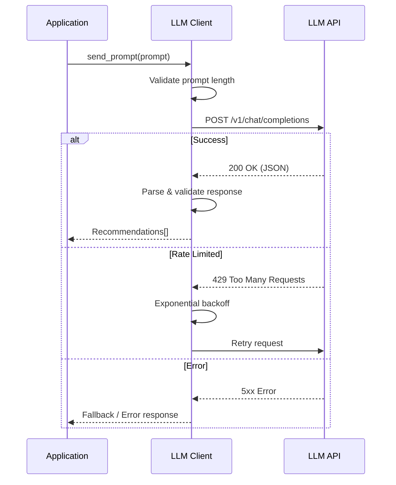
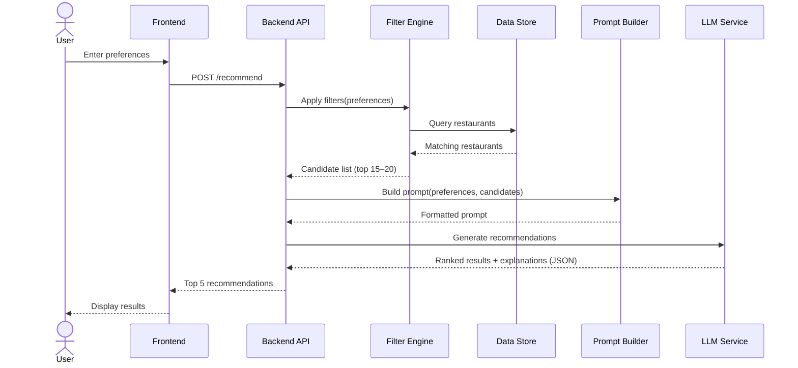

# Architecture — AI-Powered Restaurant Recommendation System

> Derived from [context.md](file:///c:/Users/anshy/OneDrive/Desktop/Zomato%20Milestone/context.md)

---

## 1. System Overview

The system is an **AI-powered restaurant recommendation service** inspired by Zomato. It ingests a real-world restaurant dataset, accepts user preferences, filters and ranks restaurants using an LLM, and presents personalized, explainable recommendations.



---

## 2. High-Level Architecture

The system follows a **three-tier architecture** with an AI integration layer:

| Tier                  | Responsibility                                               |
| --------------------- | ------------------------------------------------------------ |
| **Presentation**      | User interface for collecting preferences and displaying results |
| **Application**       | Business logic, filtering, prompt engineering, LLM orchestration |
| **Data**              | Dataset storage, preprocessing, and retrieval                |
| **AI / LLM Service**  | External LLM API for ranking and generating explanations     |



---

## 3. Component Design

### 3.1 Data Ingestion Module

**Purpose:** Load, clean, and store the Zomato dataset for fast querying.

| Aspect           | Detail                                                                                         |
| ---------------- | ---------------------------------------------------------------------------------------------- |
| **Source**        | [Hugging Face — ManikaSaini/zomato-restaurant-recommendation](https://huggingface.co/datasets/ManikaSaini/zomato-restaurant-recommendation) |
| **Trigger**      | One-time on first run, or manual refresh                                                       |
| **Output**       | Cleaned, structured data stored in memory / database                                           |

**Key Fields Extracted:**

| Field              | Type     | Description                       |
| ------------------ | -------- | --------------------------------- |
| `restaurant_name`  | `string` | Name of the restaurant            |
| `location`         | `string` | Neighbourhood / locality (e.g., Koramangala) |
| `cuisines`         | `string` | Comma-separated cuisine types     |
| `average_cost`     | `float`  | Average cost for two              |
| `aggregate_rating` | `float`  | Aggregated user rating (0–5)      |
| `votes`            | `int`    | Number of user votes              |
| `has_online_delivery` | `bool` | Online delivery availability     |
| `has_table_booking`   | `bool` | Table booking availability       |

**Processing Pipeline:**



---

### 3.2 User Input Module

**Purpose:** Collect and validate user preferences.

**Input Schema:**

```json
{
  "location": "string (required)",
  "budget": "enum: low | medium | high (required)",
  "cuisine": "string (optional)",
  "min_rating": "float: 0.0–5.0 (optional, default: 3.0)",
  "additional_preferences": "string (optional, free-text)"
}
```

**Budget Mapping:**

| Budget Level | Cost Range (₹ for two) |
| ------------ | ---------------------- |
| Low          | ₹0 – ₹500             |
| Medium       | ₹500 – ₹1500          |
| High         | ₹1500+                 |

**Validation Rules:**
- `location` must be a non-empty string, matched against available locations in the dataset
- `budget` must be one of the defined enum values
- `min_rating` must be between 0.0 and 5.0
- `cuisine` is fuzzy-matched against known cuisine types in the dataset

---

### 3.3 Filter Engine

**Purpose:** Narrow down the restaurant dataset based on user preferences before sending to the LLM.

**Filtering Strategy:**



**Design Decisions:**
- Filters are applied sequentially (location → budget → cuisine → rating)
- If fewer than 5 results remain after filtering, relax constraints in order: cuisine → budget → rating
- A maximum of **15–20 candidates** are passed to the LLM to stay within token limits
- Results are pre-sorted by `aggregate_rating` (descending), then by `votes` (descending) as a tiebreaker

---

### 3.4 Prompt Builder (Integration Layer)

**Purpose:** Construct a well-structured prompt that provides the LLM with user context and restaurant data for intelligent ranking.

**Prompt Template Structure:**

```
SYSTEM:
You are a knowledgeable restaurant recommendation assistant. Given a user's
preferences and a list of candidate restaurants, rank the top 5 restaurants
and explain why each one is a good match.

USER PREFERENCES:
- Location: {location}
- Budget: {budget}
- Cuisine preference: {cuisine}
- Minimum rating: {min_rating}
- Additional preferences: {additional_preferences}

CANDIDATE RESTAURANTS:
{formatted_restaurant_list}

INSTRUCTIONS:
1. Rank the top 5 restaurants from the candidates above.
2. For each recommendation, provide:
   - Restaurant name
   - Cuisine type
   - Rating
   - Estimated cost for two
   - A 2–3 sentence explanation of why this restaurant fits the user's preferences.
3. Return results in valid JSON format.
```

**Output Schema (expected from LLM):**

```json
{
  "recommendations": [
    {
      "restaurant_name": "string",
      "cuisine": "string",
      "rating": "float",
      "estimated_cost": "string",
      "explanation": "string"
    }
  ]
}
```

---

### 3.5 LLM Client

**Purpose:** Interface with the external LLM API, handle retries, rate-limiting, and response parsing.

| Aspect              | Detail                                               |
| -------------------- | ---------------------------------------------------- |
| **Supported LLMs**   | Groq API (LLaMA 3 / Mixtral via Groq inference)     |
| **Temperature**      | `0.7` (balanced creativity and consistency)          |
| **Max Tokens**       | `1024` (sufficient for 5 recommendations)            |
| **Retry Policy**     | Exponential backoff, max 3 retries                   |
| **Timeout**          | 30 seconds per request                               |
| **Response Format**  | JSON mode enforced where supported                   |



---

### 3.6 Output / Presentation Layer

**Purpose:** Format and display recommendations to the user in a clear, actionable format.

**Output Table Format:**

| Field                      | Description                                      |
| -------------------------- | ------------------------------------------------ |
| **Restaurant Name**        | Name of the recommended restaurant               |
| **Cuisine**                | Type of cuisine served                           |
| **Rating**                 | User/aggregated rating (★ scale)                 |
| **Estimated Cost**         | Approximate cost for two (₹)                     |
| **AI-generated Explanation** | Why this restaurant fits the user's preferences |

**UI Modes Supported:**

| Mode        | Description                                         |
| ----------- | --------------------------------------------------- |
| **CLI**     | Terminal-based table output using `rich` or `tabulate` |
| **Web UI**  | Browser-based interface with cards/table layout      |
| **API**     | Raw JSON response for programmatic consumption       |

---

## 4. Data Flow Diagram

End-to-end request lifecycle:



---

## 5. Proposed Tech Stack

| Layer              | Technology                          | Rationale                                    |
| ------------------ | ----------------------------------- | -------------------------------------------- |
| **Language**       | Python 3.10+                        | Rich ML/AI ecosystem, Hugging Face SDK       |
| **Web Framework**  | FastAPI                             | Async support, auto-generated docs, fast     |
| **Frontend**       | Streamlit or HTML/CSS/JS            | Rapid prototyping for data apps              |
| **Data Processing**| Pandas                              | Industry-standard for tabular data           |
| **LLM SDK**        | `groq`                              | Official Groq Python SDK for fast inference  |
| **Dataset Loading**| `datasets` (Hugging Face)           | Native integration with HF datasets          |
| **Caching**        | `functools.lru_cache` / Redis       | Reduce redundant LLM calls                  |
| **Env Management** | `python-dotenv`                     | Secure API key management                    |
| **Testing**        | `pytest`                            | Standard Python testing framework            |

---

## 6. API Contract

### `POST /recommend`

**Request:**

```json
{
  "location": "Delhi",
  "budget": "medium",
  "cuisine": "Italian",
  "min_rating": 4.0,
  "additional_preferences": "family-friendly with outdoor seating"
}
```

**Response (200 OK):**

```json
{
  "status": "success",
  "count": 5,
  "recommendations": [
    {
      "restaurant_name": "Olive Bar & Kitchen",
      "cuisine": "Italian, Continental",
      "rating": 4.5,
      "estimated_cost": "₹1200 for two",
      "explanation": "Olive Bar & Kitchen is a top-rated Italian restaurant in Delhi with a serene outdoor dining area, perfect for family gatherings. Its rating of 4.5 and mid-range pricing make it an excellent match for your preferences."
    }
  ],
  "metadata": {
    "total_candidates_evaluated": 18,
    "filters_applied": ["location", "budget", "cuisine", "min_rating"],
    "llm_model": "llama-3.3-70b-versatile",
    "response_time_ms": 2340
  }
}
```

**Error Response (422):**

```json
{
  "status": "error",
  "message": "Invalid location: 'Xyzville' not found in dataset",
  "valid_locations": ["Delhi", "Bangalore", "Mumbai", "..."]
}
```

---

## 7. Directory Structure (Proposed)

```
Zomato Milestone/
├── context.md                  # Project context & problem statement
├── architecture.md             # This document
├── ProblemStatement.txt        # Original problem statement
│
├── src/
│   ├── __init__.py
│   ├── main.py                 # Application entry point
│   ├── config.py               # Configuration & environment variables
│   │
│   ├── data/
│   │   ├── __init__.py
│   │   ├── loader.py           # Dataset download & ingestion
│   │   └── preprocessor.py     # Data cleaning & normalization
│   │
│   ├── models/
│   │   ├── __init__.py
│   │   ├── schemas.py          # Pydantic models (request/response)
│   │   └── restaurant.py       # Restaurant data model
│   │
│   ├── services/
│   │   ├── __init__.py
│   │   ├── filter_engine.py    # Preference-based filtering logic
│   │   ├── prompt_builder.py   # LLM prompt construction
│   │   └── llm_client.py       # LLM API integration
│   │
│   ├── api/
│   │   ├── __init__.py
│   │   └── routes.py           # FastAPI route definitions
│   │
│   └── ui/
│       ├── __init__.py
│       └── app.py              # Streamlit / CLI frontend
│
├── tests/
│   ├── test_filter_engine.py
│   ├── test_prompt_builder.py
│   └── test_llm_client.py
│
├── .env.example                # Template for environment variables
├── requirements.txt            # Python dependencies
└── README.md                   # Project documentation
```

---

## 8. Key Design Decisions

| Decision                             | Rationale                                                                    |
| ------------------------------------ | ---------------------------------------------------------------------------- |
| **Pre-filter before LLM**           | Reduces token usage and cost; keeps LLM focused on ranking, not searching    |
| **Cap candidates at 15–20**          | Balances context quality with LLM token limits                               |
| **Structured JSON output from LLM** | Enables reliable parsing and consistent UI rendering                         |
| **Graceful constraint relaxation**   | Ensures users always receive results, even with very specific preferences    |
| **Separation of filter & LLM logic**| Allows independent testing and swapping of either component                  |
| **Response caching**                 | Identical preference sets return cached results, reducing API costs          |

---

## 9. Security Considerations

| Concern                  | Mitigation                                                     |
| ------------------------ | -------------------------------------------------------------- |
| **API Key Exposure**     | Store in `.env`, never commit to version control               |
| **Prompt Injection**     | Sanitize `additional_preferences` input before prompt assembly |
| **Rate Limiting**        | Implement per-user rate limiting on the `/recommend` endpoint  |
| **Input Validation**     | Pydantic models enforce strict type/value checks               |
| **CORS**                 | Restrict origins to trusted frontend domains                   |

---

## 10. Scalability & Future Enhancements

| Enhancement                          | Description                                                        |
| ------------------------------------ | ------------------------------------------------------------------ |
| **Vector Search (RAG)**              | Embed restaurant descriptions and use semantic search for retrieval |
| **User Profiles & History**          | Store past preferences for personalized repeat recommendations     |
| **Multi-language Support**           | LLM-powered translation for regional language support              |
| **Real-time Data**                   | Integrate live Zomato/Swiggy APIs for up-to-date menus and ratings |
| **Feedback Loop**                    | Collect user feedback to fine-tune recommendation quality          |
| **Batch Processing**                 | Support bulk recommendation requests for B2B integrations         |

---

## 11. Non-Functional Requirements

| Requirement       | Target                                                |
| ----------------- | ----------------------------------------------------- |
| **Latency**       | < 5 seconds end-to-end (including LLM response)       |
| **Availability**  | 99.5% uptime for API tier                             |
| **Throughput**    | Handle ≥ 50 concurrent requests                       |
| **Data Freshness**| Dataset refresh support (manual or scheduled)         |
| **Observability** | Structured logging, request tracing, error dashboards |

---

*Last updated: 2026-06-23*
