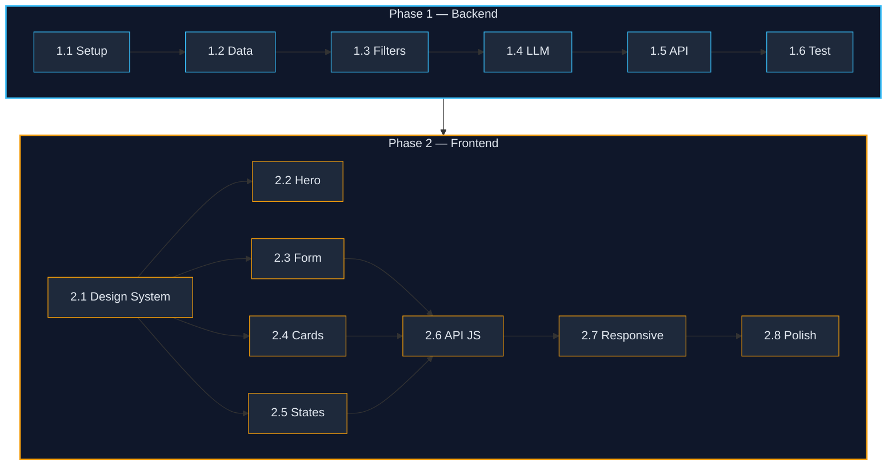

# Implementation Plan — AI-Powered Restaurant Recommendation System

> Two-phase development roadmap derived from [architecture.md](file:///c:/Users/anshy/OneDrive/Desktop/Zomato%20Milestone/architecture.md) and [context.md](file:///c:/Users/anshy/OneDrive/Desktop/Zomato%20Milestone/context.md)

---

## Phase Overview

| Phase | Title                       | Key Deliverables                                                        | Est. Duration |
| ----- | --------------------------- | ----------------------------------------------------------------------- | ------------- |
| 1     | **Backend**                 | Project setup, data pipeline, filter engine, LLM integration, REST API  | 5–8 days      |
| 2     | **Frontend**                | Premium web UI (HTML/CSS/JS), responsive design, animations, full UX    | 4–6 days      |

> **Total Estimated Duration: 9–14 days**

---
---

## Phase 1 — Backend

### Objective

Build the complete server-side system: project scaffolding, data ingestion & preprocessing, filter engine, LLM integration (Groq), and the FastAPI REST API that the frontend will consume.

---

### 1.1 — Project Setup & Configuration

#### Tasks

- [ ] **1.1.1** Create the directory structure as defined in [architecture.md § 7](file:///c:/Users/anshy/OneDrive/Desktop/Zomato%20Milestone/architecture.md#L380-L425)
  ```
  src/
  ├── __init__.py
  ├── main.py
  ├── config.py
  ├── data/
  ├── models/
  ├── services/
  ├── api/
  └── ui/
  tests/
  frontend/
  ```
- [ ] **1.1.2** Initialize `requirements.txt` with core dependencies:
  ```
  fastapi
  uvicorn[standard]
  pandas
  groq
  datasets
  python-dotenv
  pydantic
  rich
  pytest
  ```
- [ ] **1.1.3** Create `.env.example` with required variables:
  ```env
  GROQ_API_KEY=your_groq_api_key_here
  LLM_MODEL=llama-3.3-70b-versatile
  LLM_TEMPERATURE=0.7
  LLM_MAX_TOKENS=1024
  ```
- [ ] **1.1.4** Implement `src/config.py` — load environment variables via `python-dotenv`, expose a `Settings` class (Pydantic `BaseSettings`) with all configurable parameters.
- [ ] **1.1.5** Create `.gitignore` (exclude `.env`, `__pycache__`, `.venv`, `node_modules`, etc.)
- [ ] **1.1.6** Initialize `README.md` with project overview, setup instructions, and usage guide.

#### Exit Criteria
- Running `python -c "from src.config import settings; print(settings.GROQ_API_KEY)"` loads the env correctly.
- Directory structure matches the proposed layout.

---

### 1.2 — Data Ingestion & Preprocessing

#### Reference
- [context.md § Data Ingestion](file:///c:/Users/anshy/OneDrive/Desktop/Zomato%20Milestone/context.md#L22-L26)
- [architecture.md § 3.1](file:///c:/Users/anshy/OneDrive/Desktop/Zomato%20Milestone/architecture.md#L75-L108)

#### Tasks

- [ ] **1.2.1** Implement `src/data/loader.py`
  - Use the `datasets` library to download from [ManikaSaini/zomato-restaurant-recommendation](https://huggingface.co/datasets/ManikaSaini/zomato-restaurant-recommendation)
  - Cache the dataset locally after first download
  - Return data as a Pandas DataFrame

- [ ] **1.2.2** Implement `src/data/preprocessor.py`
  - **Parse & Validate** — Ensure required columns exist
  - **Normalize Fields:**
    - Standardize `cuisines` (trim, lowercase, split comma-separated values)
    - Convert `average_cost` to `float`
    - Convert `aggregate_rating` to `float`
    - Cast `votes` to `int`
    - Map `has_online_delivery` / `has_table_booking` to boolean
  - **Handle Missing Values** — Drop rows with null `restaurant_name` or `location`; fill missing ratings with `0.0`
  - **Index** — Create lookup indices by `location` and `cuisines` for fast filtering

- [ ] **1.2.3** Implement `src/models/restaurant.py`
  - Define a `Restaurant` Pydantic model matching the key fields:
    ```python
    class Restaurant(BaseModel):
        restaurant_name: str
        location: str
        cuisines: str
        average_cost: float
        aggregate_rating: float
        votes: int
        has_online_delivery: bool
        has_table_booking: bool
    ```

- [ ] **1.2.4** Write unit tests: `tests/test_data_loader.py`
  - Verify dataset loads without errors
  - Verify preprocessing produces expected columns and types
  - Verify no critical null values remain after cleaning

#### Exit Criteria
- `loader.py` downloads and caches the dataset successfully.
- `preprocessor.py` outputs a clean DataFrame with all expected columns and correct types.
- All data ingestion tests pass.

---

### 1.3 — Filter Engine & User Input

#### Reference
- [context.md § User Input](file:///c:/Users/anshy/OneDrive/Desktop/Zomato%20Milestone/context.md#L28-L36)
- [architecture.md § 3.2 & 3.3](file:///c:/Users/anshy/OneDrive/Desktop/Zomato%20Milestone/architecture.md#L112-L166)

#### Tasks

- [ ] **1.3.1** Implement `src/models/schemas.py`
  - Define `RecommendationRequest` Pydantic model:
    ```python
    class RecommendationRequest(BaseModel):
        location: str                                  # required
        budget: Literal["low", "medium", "high"]       # required
        cuisine: Optional[str] = None                  # optional
        min_rating: float = Field(default=3.0, ge=0.0, le=5.0)
        additional_preferences: Optional[str] = None   # free-text
    ```
  - Define `RecommendationResponse` and `RestaurantRecommendation` models for API output
  - Define budget mapping:
    | Budget | Cost Range (₹ for two) |
    | ------ | ---------------------- |
    | low    | ₹0 – ₹500             |
    | medium | ₹500 – ₹1500          |
    | high   | ₹1500+                 |

- [ ] **1.3.2** Implement `src/services/filter_engine.py`
  - Apply filters **sequentially**: Location → Budget → Cuisine → Min Rating
  - Implement **graceful constraint relaxation**:
    - If < 5 results after all filters, relax in order: cuisine → budget → rating
  - Sort results by `aggregate_rating` (desc), then `votes` (desc) as tiebreaker
  - Return top **15–20 candidates** to pass to the LLM

- [ ] **1.3.3** Implement fuzzy matching for `cuisine` input
  - Match user input against known cuisine types in the dataset
  - Use case-insensitive substring matching or `difflib.get_close_matches`

- [ ] **1.3.4** Implement location validation
  - Check user-provided `location` against distinct locations in the loaded dataset
  - Return helpful error with `valid_locations` list if no match found

- [ ] **1.3.5** Write unit tests: `tests/test_filter_engine.py`
  - Test each filter stage independently
  - Test constraint relaxation behavior
  - Test edge cases (no results, single result, exact match, fuzzy match)

#### Exit Criteria
- Filter engine correctly narrows down candidates across all filter stages.
- Constraint relaxation works when too few results are found.
- All filter engine tests pass.

---

### 1.4 — LLM Integration (Groq)

#### Reference
- [context.md § Integration Layer & Recommendation Engine](file:///c:/Users/anshy/OneDrive/Desktop/Zomato%20Milestone/context.md#L38-L50)
- [architecture.md § 3.4 & 3.5](file:///c:/Users/anshy/OneDrive/Desktop/Zomato%20Milestone/architecture.md#L169-L254)

#### Tasks

- [ ] **1.4.1** Implement `src/services/prompt_builder.py`
  - Build the system prompt defining the LLM's role as a restaurant recommendation assistant
  - Format user preferences into a structured block
  - Format the candidate restaurant list (from the filter engine) into a readable, token-efficient format
  - Include instructions for the LLM to:
    1. Rank top 5 restaurants
    2. Provide explanation for each
    3. Return valid JSON output
  - Sanitize `additional_preferences` to mitigate prompt injection

- [ ] **1.4.2** Implement `src/services/llm_client.py`
  - Initialize the Groq client using `GROQ_API_KEY` from config
  - Send prompt via `groq.Client.chat.completions.create()`
  - Configure:
    | Parameter        | Value                         |
    | ---------------- | ----------------------------- |
    | `model`          | `llama-3.3-70b-versatile`     |
    | `temperature`    | `0.7`                         |
    | `max_tokens`     | `1024`                        |
    | `response_format`| `{"type": "json_object"}`     |
  - Implement **retry logic** with exponential backoff (max 3 retries)
  - Handle rate limiting (HTTP 429) and server errors (5xx)
  - Set request timeout to 30 seconds

- [ ] **1.4.3** Implement response parsing & validation
  - Parse the LLM's JSON response into `RestaurantRecommendation` Pydantic models
  - Handle malformed JSON gracefully (log error, return fallback response)
  - Validate that each recommendation references a restaurant from the candidate set

- [ ] **1.4.4** Implement response caching
  - Cache LLM responses using `functools.lru_cache` or a simple in-memory dict
  - Cache key: hash of (location, budget, cuisine, min_rating, additional_preferences)
  - Cache TTL: configurable, default 1 hour

- [ ] **1.4.5** Write unit tests: `tests/test_prompt_builder.py` and `tests/test_llm_client.py`
  - Test prompt construction produces expected format
  - Test response parsing with valid/invalid JSON samples
  - Test retry logic with mocked API responses
  - Test caching behavior (cache hit vs. miss)

#### Exit Criteria
- Prompt builder produces well-structured prompts within token limits.
- Groq client successfully sends requests and parses responses.
- Retry and error handling work correctly.
- All LLM integration tests pass.

---

### 1.5 — REST API Layer

#### Reference
- [architecture.md § 3.6, § 4, § 6](file:///c:/Users/anshy/OneDrive/Desktop/Zomato%20Milestone/architecture.md#L258-L376)

#### Tasks

- [ ] **1.5.1** Implement `src/api/routes.py`
  - **`POST /recommend`** — Main recommendation endpoint
    - Accept `RecommendationRequest` body
    - Orchestrate: validate input → filter → build prompt → call LLM → return response
    - Return `RecommendationResponse` with metadata (candidates evaluated, filters applied, model used, response time)
  - **`GET /locations`** — Return list of valid locations from the dataset
  - **`GET /cuisines`** — Return list of known cuisine types
  - **`GET /health`** — Health check endpoint

- [ ] **1.5.2** Implement `src/main.py`
  - Initialize FastAPI app with CORS middleware (allow `*` origins for local dev)
  - Load dataset on startup (lifespan event)
  - Register API routes
  - Configure structured logging

- [ ] **1.5.3** Add error handling middleware
  - Return `422` for validation errors with helpful messages
  - Return `503` for LLM service unavailability
  - Return `500` for unexpected errors with sanitized messages

- [ ] **1.5.4** Implement rate limiting
  - Per-user/IP rate limiting on `/recommend` (e.g., 10 requests/minute)

- [ ] **1.5.5** Write integration tests: `tests/test_api.py`
  - Test all endpoints with valid/invalid payloads
  - End-to-end test: user input → API → filter → LLM → response

#### Exit Criteria
- All API endpoints return correct, well-structured JSON responses.
- Error cases return appropriate HTTP status codes and messages.
- CORS headers are configured for frontend consumption.
- All API tests pass.

---

### 1.6 — Backend Testing, Security & Documentation

#### Tasks

##### Testing
- [ ] **1.6.1** Run full backend test suite:
  ```bash
  pytest tests/ -v --tb=short
  ```

##### Security Hardening
- [ ] **1.6.2** Validate `.env` is in `.gitignore` — API keys never committed
- [ ] **1.6.3** Sanitize all user inputs (especially `additional_preferences`) before prompt assembly
- [ ] **1.6.4** Restrict CORS origins to trusted domains (production config)
- [ ] **1.6.5** Implement input length limits to prevent abuse

##### Performance
- [ ] **1.6.6** Profile and optimize the filter engine for large datasets
- [ ] **1.6.7** Verify caching reduces redundant Groq API calls
- [ ] **1.6.8** Ensure end-to-end API latency is **< 5 seconds** (target from [architecture.md § 11](file:///c:/Users/anshy/OneDrive/Desktop/Zomato%20Milestone/architecture.md#L467-L475))

##### Documentation
- [ ] **1.6.9** Add inline docstrings and comments to all backend modules
- [ ] **1.6.10** Document API contract in `README.md` with example requests/responses

#### Exit Criteria
- All backend unit and integration tests pass.
- Backend runs standalone and responds correctly to API calls via cURL / Postman.
- API documentation is complete.

---
---

## Phase 2 — Frontend

### Objective

Build a **premium, modern web frontend** using vanilla HTML, CSS, and JavaScript that consumes the FastAPI backend. The frontend should deliver a visually stunning, responsive, and polished user experience — not a quick prototype, but a production-quality interface.

---

### 2.1 — Design System & Foundation

#### Tasks

- [ ] **2.1.1** Create `frontend/index.html` — semantic HTML5 structure
  - Single `<h1>` with proper heading hierarchy
  - Meta tags for SEO (title, description, viewport, charset)
  - Google Fonts integration (Inter or Outfit for a clean, modern feel)
  - Unique IDs on all interactive elements

- [ ] **2.1.2** Create `frontend/css/style.css` — comprehensive design system
  - **Color Palette**: Dark theme with rich gradients
    - Background: deep charcoal (`#0f0f1a`) to midnight blue (`#1a1a2e`)
    - Primary accent: vibrant coral-to-amber gradient (`#ff6b35` → `#f7c948`)
    - Secondary: soft teal/cyan (`#00d4aa`)
    - Card surfaces: frosted glass (`rgba(255,255,255,0.05)`) with backdrop blur
    - Text: warm white (`#f0ede6`) with muted secondary (`#8a8a9a`)
  - **Typography**: Inter/Outfit from Google Fonts, fluid sizing with `clamp()`
  - **CSS Custom Properties**: All design tokens as variables for easy theming
  - **Glassmorphism**: Card backgrounds with `backdrop-filter: blur()` and subtle borders
  - **Responsive Grid**: CSS Grid + Flexbox for all layouts, mobile-first breakpoints

- [ ] **2.1.3** Create `frontend/css/animations.css` — micro-animations & transitions
  - Smooth fade-in / slide-up for recommendation cards (staggered with `animation-delay`)
  - Hover effects: subtle lift (`translateY(-4px)`), glow on accent elements
  - Loading skeleton shimmer animation for API wait states
  - Pulse animation for the "Get Recommendations" button
  - Page entrance animations for hero section
  - Star rating sparkle effect

#### Exit Criteria
- Design system CSS loads correctly with all tokens defined.
- HTML structure passes basic accessibility checks.
- Animations are smooth at 60fps.

---

### 2.2 — Hero Section & Navigation

#### Tasks

- [ ] **2.2.1** Build the **hero/header section**
  - App branding: logo/icon + app name with gradient text effect
  - Tagline: animated typing effect or fade-in reveal
  - Subtle background pattern or animated gradient mesh
  - Navigation bar with glassmorphism effect (sticky on scroll)

- [ ] **2.2.2** Implement **scroll-based effects**
  - Sticky navigation that gains background opacity on scroll
  - Smooth scroll behavior for anchor links
  - Parallax effect on hero background (subtle)

#### Exit Criteria
- Hero section makes a strong visual first impression.
- Navigation is functional and visually polished.

---

### 2.3 — Preference Input Form

#### Tasks

- [ ] **2.3.1** Build the **preference form** section
  - **Location Selector**: Searchable dropdown with autocomplete
    - Populated dynamically from `GET /locations`
    - Custom-styled dropdown with glassmorphism
    - Search/filter functionality as user types
    - Map pin icon decoration
  - **Budget Selector**: Three stylish toggle buttons (Low / Medium / High)
    - Visual indicator showing price range (₹ symbols)
    - Active state with gradient highlight and scale animation
    - Tooltip showing exact price range on hover
  - **Cuisine Input**: Text input with autocomplete suggestions
    - Populated from `GET /cuisines`
    - Dropdown suggestions appear as user types
    - Tag-style display for selected cuisine
    - Fork/knife icon decoration
  - **Minimum Rating Slider**: Custom-styled range slider
    - Visual star display that fills as slider moves (★★★★☆)
    - Current value displayed in a floating tooltip above thumb
    - Gradient track (grey → gold)
  - **Additional Preferences**: Styled textarea
    - Placeholder text with example preferences
    - Character counter (max 500)
    - Subtle border glow on focus

- [ ] **2.3.2** Implement **form validation** (client-side)
  - Required field indicators with animated error states
  - Inline validation messages with slide-down animation
  - Disable submit button until required fields are filled
  - Shake animation on invalid submission attempt

- [ ] **2.3.3** Build the **"Get Recommendations" CTA button**
  - Gradient background with shimmer hover effect
  - Loading state: button text replaced with animated spinner + "Finding perfect spots…"
  - Disabled state styling when form is invalid
  - Ripple click effect

#### Exit Criteria
- All form inputs are functional, styled, and validated.
- Dropdowns are populated from API data.
- Form is fully responsive across screen sizes.

---

### 2.4 — Results Display & Recommendation Cards

#### Tasks

- [ ] **2.4.1** Build the **recommendation card** component
  - Each card displays:
    - **Restaurant name** — large, prominent font with gradient text on hover
    - **Cuisine tags** — pill/badge style with subtle background color
    - **Rating** — animated star display (★★★★☆) with exact numeric value
    - **Estimated cost** — with ₹ symbol and budget-tier color coding
    - **Online delivery / Table booking** — icon badges (✓ / ✗) with tooltips
    - **AI Explanation** — LLM-generated text in a distinct, quote-styled block
  - Card styling:
    - Glassmorphism surface with subtle border
    - Ranking number badge (1–5) with gradient background
    - Entrance animation: staggered slide-up + fade-in
    - Hover: subtle lift + shadow expansion + border glow

- [ ] **2.4.2** Build the **results grid layout**
  - Responsive grid: 1 column (mobile) → 2 columns (tablet) → 3 columns (desktop) for top 3, then 2 columns for remaining
  - Alternatively: featured #1 card (larger) + grid of remaining 4
  - Smooth re-layout on window resize
  - Empty state with illustration and message when no results

- [ ] **2.4.3** Build the **metadata/stats bar**
  - Display below results in a sleek, compact bar:
    - Candidates evaluated (e.g., "18 restaurants analyzed")
    - Filters applied (visual pills)
    - LLM model used
    - Response time (e.g., "2.3s")
  - Icon decorations for each stat
  - Glassmorphism background

- [ ] **2.4.4** Implement **"New Search" flow**
  - Button or link to clear results and scroll back to the form
  - Smooth transition: results fade out, form scrolls into view
  - Form retains previous values for easy modification

#### Exit Criteria
- Cards display all recommendation data beautifully.
- Layout is responsive and visually balanced.
- Animations are smooth and delightful.

---

### 2.5 — Loading, Error & Empty States

#### Tasks

- [ ] **2.5.1** Build **loading state** (while waiting for `/recommend` response)
  - Skeleton card placeholders (3–5 cards) with shimmer animation
  - Animated progress text: "Analyzing restaurants…" → "Consulting AI chef…" → "Plating recommendations…"
  - Pulsing brand accent color
  - Disable form inputs during loading

- [ ] **2.5.2** Build **error state** UI
  - Friendly error message with icon (⚠️) — no raw technical details
  - Different messages for:
    - Network error / API unreachable
    - No results found (with suggestion to broaden filters)
    - LLM service temporarily unavailable (503)
    - Rate limit exceeded (429)
  - "Try Again" button with retry logic
  - Entrance animation: fade-in + slight bounce

- [ ] **2.5.3** Build **empty state** UI
  - When the app first loads (no search performed yet)
  - Illustrated placeholder encouraging the user to start
  - Animated food/restaurant icons or subtle background elements

#### Exit Criteria
- All states (loading, error, empty) are visually handled — no raw errors shown.
- Transitions between states are smooth.

---

### 2.6 — API Integration (JavaScript)

#### Tasks

- [ ] **2.6.1** Create `frontend/js/api.js` — API client module
  - `fetchLocations()` — `GET /locations`, cache result in memory
  - `fetchCuisines()` — `GET /cuisines`, cache result in memory
  - `fetchRecommendations(preferences)` — `POST /recommend`
  - `checkHealth()` — `GET /health`
  - Configurable `BASE_URL` (default: `http://localhost:8000`)
  - Proper error handling with typed error responses
  - Request timeout handling (30s)

- [ ] **2.6.2** Create `frontend/js/app.js` — main application logic
  - On page load:
    1. Call `checkHealth()` to verify backend is reachable
    2. Call `fetchLocations()` and `fetchCuisines()` to populate dropdowns
  - On form submit:
    1. Validate inputs
    2. Show loading state
    3. Call `fetchRecommendations()`
    4. On success: render result cards with staggered animation
    5. On error: show appropriate error state
  - Event listeners for all interactive elements
  - Debounced search input for autocomplete dropdowns

- [ ] **2.6.3** Create `frontend/js/components.js` — DOM rendering helpers
  - `renderRecommendationCard(data, index)` — generates card HTML
  - `renderMetadataBar(metadata)` — generates stats bar
  - `renderSkeletonCards(count)` — loading placeholder cards
  - `renderErrorState(error)` — error display
  - `renderStarRating(rating)` — visual star display (filled/half/empty)
  - `renderCuisineTags(cuisineString)` — pill badges from comma-separated string

#### Exit Criteria
- Frontend successfully communicates with all backend endpoints.
- Data flows end-to-end: form → API → rendered cards.
- Error handling covers all failure modes.

---

### 2.7 — Responsive Design & Cross-Browser Polish

#### Tasks

- [ ] **2.7.1** Implement responsive breakpoints
  - **Mobile** (< 640px): single column, stacked cards, full-width inputs
  - **Tablet** (640px–1024px): 2-column grid, side-by-side budget toggles
  - **Desktop** (> 1024px): full layout with max-width container, spacious cards
  - **Large Desktop** (> 1440px): wider max-width, larger typography

- [ ] **2.7.2** Mobile-specific optimizations
  - Touch-friendly input sizing (min 44px tap targets)
  - Bottom-anchored CTA button on mobile (optional)
  - Swipeable card carousel on mobile (optional enhancement)
  - Smooth scrolling to results after submission

- [ ] **2.7.3** Cross-browser testing
  - Chrome, Firefox, Edge, Safari
  - Verify `backdrop-filter` fallback for unsupported browsers
  - Test CSS custom properties support
  - Verify smooth animations on all browsers

- [ ] **2.7.4** Accessibility pass
  - Keyboard navigation for all interactive elements
  - ARIA labels on custom form controls
  - Color contrast ratios meet WCAG AA (4.5:1 for body text)
  - Screen reader friendly card structure
  - Focus-visible styling for keyboard users

#### Exit Criteria
- UI looks great on mobile, tablet, and desktop.
- No visual breakage across major browsers.
- Passes basic accessibility audit.

---

### 2.8 — Final Polish & Integration Testing

#### Tasks

- [ ] **2.8.1** End-to-end integration testing
  - Start FastAPI backend → open frontend → perform search → verify results display
  - Test with various preference combinations
  - Test error scenarios (backend down, invalid inputs, no results)

- [ ] **2.8.2** Performance optimization
  - Minimize CSS (remove unused rules)
  - Optimize JavaScript (no unnecessary DOM operations)
  - Ensure first contentful paint < 1.5s
  - Lazy-load non-critical CSS (animations)

- [ ] **2.8.3** Final visual QA
  - Screenshot review at all breakpoints
  - Animation timing and easing feel natural
  - Typography hierarchy is clear and readable
  - Color consistency across all components
  - Dark theme readability check

- [ ] **2.8.4** Update `README.md` with:
  - Frontend setup instructions
  - How to run backend + frontend together
  - Screenshots of the UI
  - Environment variable reference
  - Example usage walkthrough

- [ ] **2.8.5** Prepare deployment configuration
  - `Procfile` or `Dockerfile` for deployment
  - FastAPI serves static frontend files (or document separate hosting)
  - Document deployment steps for chosen platform

#### Exit Criteria
- Full end-to-end flow works seamlessly.
- UI looks premium and polished at every viewport.
- Documentation is complete and includes screenshots.
- Application is deployment-ready.

---
---

## Dependency Graph



---

## Frontend File Structure

```
frontend/
├── index.html              # Main HTML page (semantic, SEO-optimized)
├── css/
│   ├── style.css           # Core design system & layout
│   └── animations.css      # Micro-animations & transitions
├── js/
│   ├── api.js              # API client (fetch wrappers)
│   ├── app.js              # Main application logic & event handling
│   └── components.js       # DOM rendering helpers (cards, stars, etc.)
└── assets/
    └── icons/              # SVG icons (if needed)
```

---

## Design Philosophy

| Principle                    | Implementation                                                          |
| ---------------------------- | ----------------------------------------------------------------------- |
| **Dark & Premium**           | Deep charcoal/midnight base with vibrant accent gradients               |
| **Glassmorphism**            | Frosted glass cards with `backdrop-filter: blur()` and subtle borders   |
| **Micro-Animations**         | Staggered card entrances, hover lifts, shimmer loading, pulse CTAs      |
| **Typography-First**         | Inter/Outfit fonts, clear hierarchy, fluid `clamp()` sizing             |
| **Mobile-First Responsive**  | Breakpoints at 640px, 1024px, 1440px with graceful adaptation           |
| **Delightful States**        | Skeleton loading, friendly errors, animated empty states                |

---

## Risk Mitigation

| Risk                                | Likelihood | Impact | Mitigation                                                            |
| ----------------------------------- | ---------- | ------ | --------------------------------------------------------------------- |
| Groq API rate limits hit            | Medium     | High   | Implement caching, exponential backoff, and request throttling        |
| Dataset schema changes on HF       | Low        | Medium | Pin dataset version; add schema validation in `preprocessor.py`       |
| LLM returns malformed JSON         | Medium     | Medium | Validate response schema; implement fallback (return raw candidates)  |
| High latency on complex queries    | Medium     | Medium | Pre-filter aggressively; cap candidates at 15–20; use Groq's fast inference |
| API key leakage                    | Low        | High   | `.env` + `.gitignore`; never log keys; use environment variables only |
| `backdrop-filter` browser support  | Low        | Low    | CSS fallback with solid semi-transparent background                   |
| Frontend perf on low-end devices   | Low        | Medium | Use `prefers-reduced-motion` media query to disable heavy animations  |

---

*Derived from [architecture.md](file:///c:/Users/anshy/OneDrive/Desktop/Zomato%20Milestone/architecture.md) and [context.md](file:///c:/Users/anshy/OneDrive/Desktop/Zomato%20Milestone/context.md)*
*Last updated: 2026-06-27*
